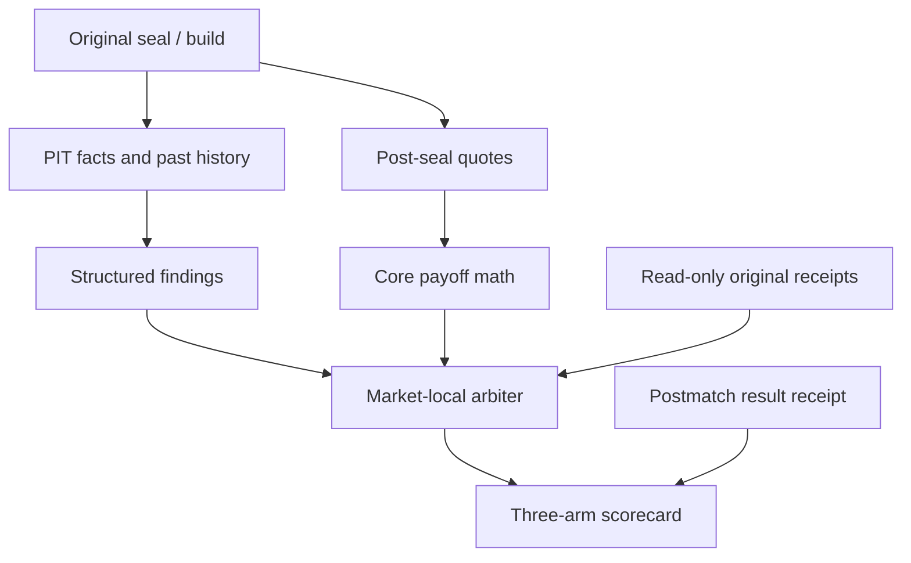

# ARENA control v0.2

Контрольный слой читает original seal, не меняет P, Policy, stake, исходное
решение или ledger. Рецензии — evidence findings, без majority vote.
Любой output: stake=0, monetary_permission=false, execution_enabled=false.

## Point-in-time

sports.as_of ≤ seal ≤ review.as_of < kickoff; quote observed/received
проверяются Core validate_quote. Только original sealed pool и compatible
code/model/Policy. Sports reviewers не видят quote/EV, priced reviewers
получают original rows после seal. Каждая view копируется и хешируется.

Core inspect выбирает active/reliable/fresh FACT; history проходит
eligible_history и original used_history. Future results исключаются.
Имена игроков, narratives и arbitrary nested fields не передаются: lineup,
injury/tactics становятся структурными summaries. Эта потеря подробностей
явная; текст сам по себе не становится доказанным causal veto.
Reviewer не получает tools/network/secrets, не создаёт новые evidence facts.

## Строгая finding schema

arena-finding-v0.2: exact role/phase, sealed market_key или null, visible
FACT premise_id или candidate:key, state SUPPORTED/DISPUTED/UNKNOWN/
HARD_BLOCK, severity INFO/WARN/BLOCK, bounded mechanism/action,
unique evidence_ids, exact independence_groups, effective_at не позже
phase cutoff и не раньше receipt факта, confidence_label EVIDENCE_BOUND/
UNVERIFIED, bounded unknowns, impact_on_probability=UNQUANTIFIED и
monetary_permission=false. Unknown fields/IDs/numeric confidence запрещены.

HARD_BLOCK требует конкретный market и FACT premise. Null-market reviewer
global veto отвергается. Integrity/time/build failures остаются системными;
original global/local Core blockers сохраняются. Нет original recheck →
CANONICAL_RECHECK_NOT_RECORDED. UNKNOWN/DISPUTED не становятся research_focus.
Graph FACT→premise→market показывает SUPPORTS/CONTRADICTS/UNKNOWN без
оценки влияния на вероятность. Ranked alternatives используют прежние P/EV.

RULE_ONLY — восемь deterministic checks, gpt_calls=0; REPLAY проверяет
записанные findings. CUSTOM_SHADOW не объявляется GPT, calls/cost=null.
Live LLM adapter в v0.2 не включён; прежний opt-in v0 остаётся отдельным.

## Read-only receipts / three arms

ledger_bridge: fresh read-only SQLite transaction, verify hash chain/content
bindings. Prediction совпадает по canonical content; RECORD есть по cutoff
с seal time. Original decision — сохранённый PASS/BET с тем же prediction,
exact cutoff и exact quotes. Missing ≠ PASS, mismatch explicit ID — ошибка.
В summary нет bankroll/portfolio, Service.decide не вызывается для backfill.

LOCAL_LEDGER_BOUND подтверждает согласованность локального журнала, но
не внешнюю подлинность часов/источника. Unbound seal → global
PROVENANCE_UNVERIFIED. Manifest всегда self-attested:
prospective_validated=false даже при bound local records.

Plan v0.2 регистрирует match_id/kickoff до seals, без prediction ID. Затем
binding: plan ≤ seal ≤ review < kickoff. min_ev принадлежит frozen plan
identity; rehash изменённого manifest означает другой unverified experiment,
а не доказательство прежней регистрации. Protected external timestamps нет.

Score records: match_id, prediction, quotes, original arena report, result/
null. Reproduce normative fields, findings и receipts; later missing-original
backfill не меняет старый report. Result: exact fixture, regulation goals,
finish ≥ kickoff+90 min, finish ≤ received ≤ evaluation as_of. Source text
отдельно от локального result RECORD. Три arms: original saved decision,
naive top EV и ARENA screen. Один hypothetical unit single, PASS=0,
missing arm=null. Все пропуски остаются в planned denominator.

Per-planned P&L=null при unavailable arm/selected outcome. Rejected
winners/losers — hindsight, не true value. Exploratory original-vs-ARENA
date-cluster interval при 30 settled/8 dates только для nonsynthetic,
aligned, local receipt-bound pairs; edge_certified=false. Базовые P не меняются.

Reports serialized first, exclusive create/flush/fsync; partial write удаляет
только свой новый файл. Existing output не перезаписывается. Это create-once
поведение приложения, не защита от администратора. v0/v1 читаются отдельно,
без тихого переобозначения их результатов как v0.2.

## Команды

    python scripts/arena_control.py --prediction prediction.json --quotes quotes.json --at ACTUAL_ISO_TIME --db data/offline.sqlite --output arena-v02.json
    python scripts/arena_control_forward.py freeze fixtures.json --created-at ACTUAL_ISO_TIME --output plan-v02.json
    python scripts/arena_control_forward.py score plan-v02.json records.json --as-of ACTUAL_POSTMATCH_TIME --db data/offline.sqlite --output score-v02.json

Подставлять только реальные observed timestamps и compatible archived build;
не backdate manifest/seals. Новые команды не добавлены в canonical CLI.
